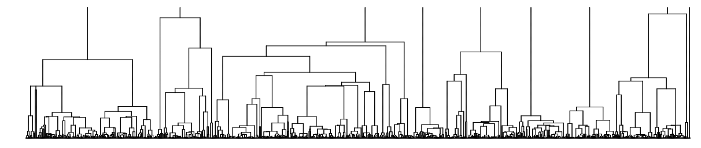
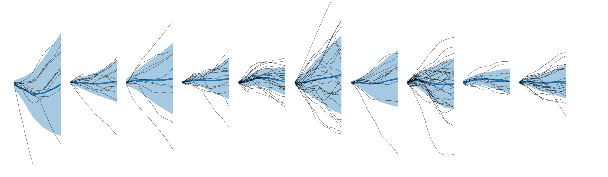
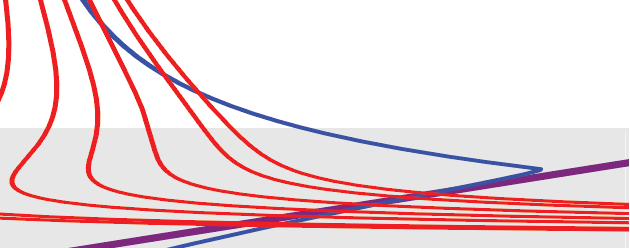

# Research

  I am broadly interested in a wide range of questions, both mathematical and biological.

  For a complete list of publications, see my 
  <a href="https://scholar.google.com/citations?user=hshuLN4AAAAJ&hl=en">Google Scholar</a>.

 <h2> Evolution and disordered systems </h2>
  
  

  
    

<strong>Growing systems and extremal statistics</strong>

My reserach in this area includes:
<ul>
  <li>
    <strong>branching processes </strong>, which are models of population growth where individuals do not interact. 
    These appear in biology, but also in machine learning and statistical physics. 
    The Feynman–Kac formula, which relates growth exponents to path integrals, plays a central role in this work. 
    I have collaborated with Farshid Jafarpour (Utrecht University) in this area.
  </li>
  <li>
    Mathematical aspects of <strong>extremal statistics and large deviation theory</strong>. Both theories concern different notions of ``extremal'' events in probability theory. I have become particularly interested in connections between these areas and geometry. 
  </li>
</ul>
    

  

<h2> Single-cell physiology </h2>
  
  

   
In biology, I am interested in single-cell physiology, including:

<ul>
  <li>
    <strong>Size homeostasis</strong> — how do cells regulate their size? 
    Do large cells slow down their growth rate, or do they accelerate their generation time? 
    In this area I have worked with Ariel Amir (Weizmann Institute of Science), Teemu Miettinen (MIT), and (my graduate student) Jessica Rattray.
  </li>
  <li>
    <strong>Gene expression under antibiotic stress</strong>, especially how patterns of gene expression change under stress. This is ongoing work with Daniel Schultz (Geisel School of Medicine) and his group. 
  </li>
  <li>
    <strong>Inference of extreme events in cell populations</strong>, joint work with Ariel Amir and Trevor GrandPre (Washington University).
  </li>
</ul>
  

<!-- 

<h2> Gene expression and stress </h2>
  
  

    
How do globel resource allocations strategies interact with gene networks and shape stress response in single-cells?  

  

 -->

